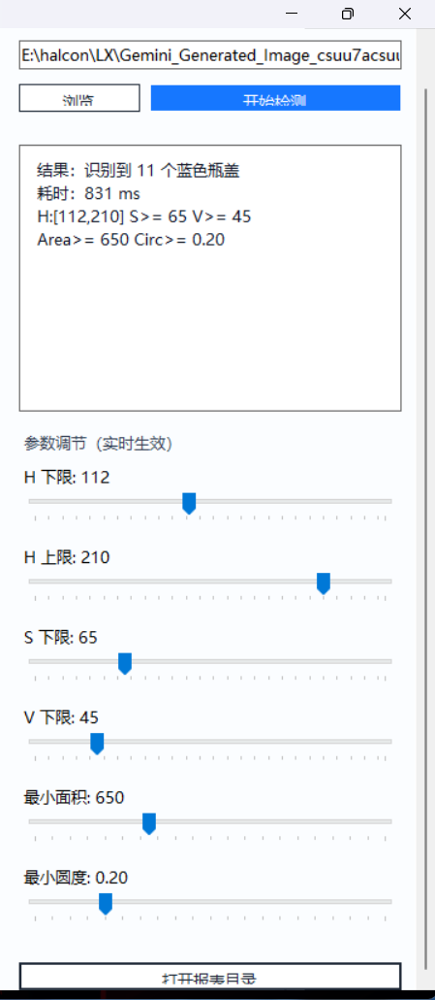

# BottleScanner (HALCON + C++/CLI WinForms)

BottleScanner 是一个基于 HALCON 的瓶盖检测演示项目，提供 C++ 检测引擎与 WinForms 可视化界面，支持参数实时调节、检测结果可视化、检测日志 CSV 自动落盘。

## 功能亮点

- 蓝色瓶盖检测：HSV 阈值 + 形态学 + 分水岭分割 + 形状筛选
- 实时参数调节：H/S/V、最小面积、最小圆度
- 可视化显示：HALCON 窗口叠加绿色轮廓
- 结果一致性：显示对象与计数对象统一
- 日志报表：自动写入 `Log/yyyy-MM-dd.csv`
- 一键打开报表目录

## 技术栈

- C++ / HALCON (核心检测)
- C++/CLI + WinForms (桌面 GUI)
- Visual Studio (MSVC)

## 项目结构

- `BottleScanner.cpp/.h`：检测主流程
- `BottleScannerWinFormsCli/MainForm.h`：WinForms UI 与交互
- `MyVision/`：控制台/验证工程
- `docs/showcase/`：展示图片

## 运行方式

1. 使用 Visual Studio 打开解决方案：
   - `BottleScannerWinFormsCli/BottleScannerWinFormsCli.slnx` 或
   - `BottleScannerWinFormsCli2/BottleScannerWinFormsCli2.slnx`
2. 配置 HALCON include/lib 与运行时环境。
3. 启动 WinForms 程序，选择图片，点击“开始检测”。

## 展示图片

### 1) HALCON HDevelop 调试界面（彩色原图）

### 2) HALCON HDevelop 调试界面（灰度中间结果）

### 3) WinForms 检测界面（场景 A）

### 4) WinForms 检测界面（场景 B）

## 日志输出格式

程序运行目录下自动创建：

- `Log/yyyy-MM-dd.csv`

CSV 表头：

- `时间,数量,耗时(ms),自适应S阈值`

## 说明

本项目用于工程能力展示与算法流程演示，可作为面试作品集项目。
